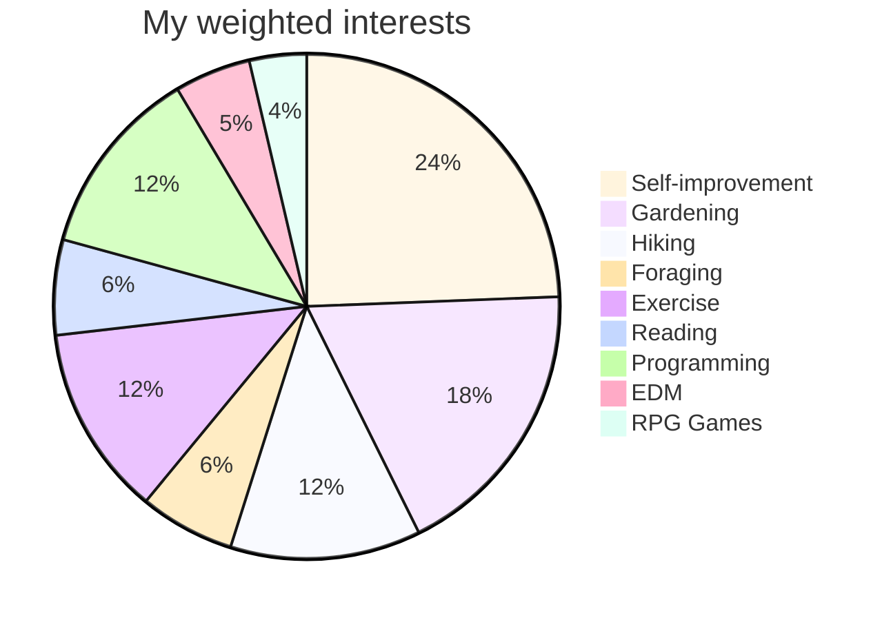

# greysch.github.io
[My main GitHub page](https://github.com/greysch)
## CTI.110 Work

Hello, my name is Nick Schlarb or "Grey" (my middle name)!
- My email: **ngschlarb@my.waketech.edu** or schlarbgrey@gmail.com

&nbsp;

This is both my personal and school GitHub account.

This repository will hold my school assignments for the **2025 CTI.110 class**.

&nbsp;

# About Me

I was formerly a professional electrician, plumber, and carpenter. I decided to quit life in the trades to pursue my life-long hobby as an computer enthusiast and to start acting upon the many software and app ideas that I've saved over the years. So far, I'm loving the switch! My end goals are to own a self-sufficient homestead and be in a position to help people financially who need it more than I do. Currently 28!
## My interests:

* I'm mostly interested in self-improvement, gardening, hiking, foraging, exercise, reading, and most recently, **programming**.

## Websites I recommend:

* [Bagerbach](https://bagerbach.com/) - a developer's blog with useful info for a wide variety of things
* [Dev](https://dev.to/) - a developer community, also with a wide variety of useful info
* [Reddit](https://www.reddit.com/) - a community for sharing knowledge and ideas like no other

&nbsp;

&nbsp;
