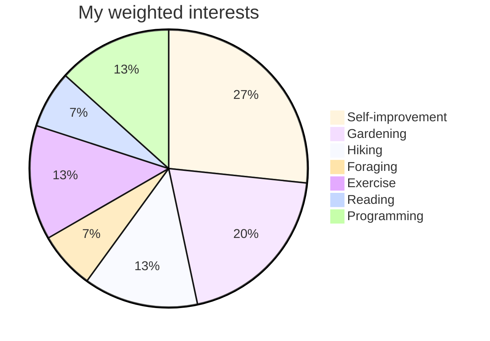

# greysch.github.io
[My main GitHub page](https://github.com/greysch)
## CTI.110 Lesson 1: Lab

Hello, my name is Nick Schlarb or "Grey" (my middle name)!
- My email: **ngschlarb@my.waketech.edu** or schlarbgrey@gmail.com

&nbsp;

This is both my personal and school GitHub account.

This repository will hold my school assignments for the **2025 CTI.110 class**.

&nbsp;

# About Me

## My interests:

* I'm mostly interested in self-improvement, gardening, hiking, foraging, exercise, reading, and most recently, **programming**.

## Websites I recommend:

* [Bagerbach](https://bagerbach.com/) - a developer's blog with useful info for a wide variety of things
* [Dev](https://dev.to/) - a developer community, also with a wide variety of useful info
* [Reddit](https://www.reddit.com/) - a community for sharing knowledge and ideas like no other

&nbsp;

&nbsp;
